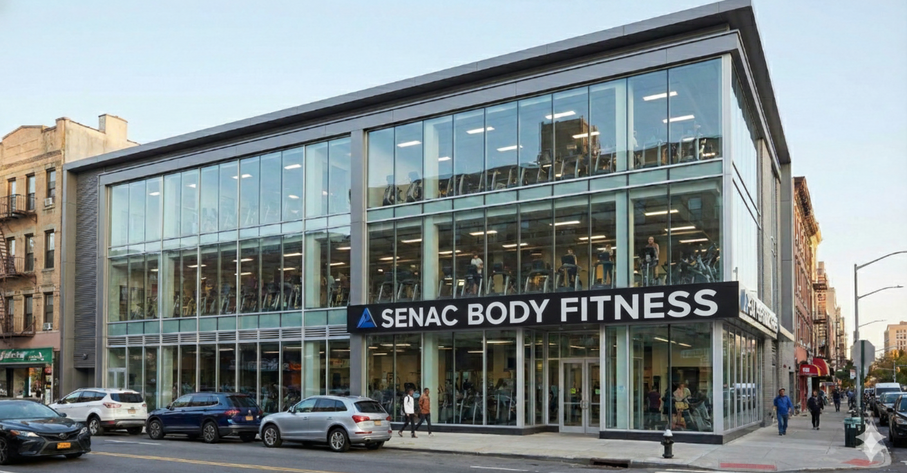

# Projeto SENAC BodyFitness - Landing Page com Bootstrap

Este é um projeto de landing page para uma academia fictícia, a "SENAC BodyFitness", desenvolvido como parte do curso de Front-End do SENAC, sob a orientação do Professor Pisco. O objetivo foi aplicar conceitos de HTML5, CSS3 e, principalmente, o framework Bootstrap 5 para criar uma página responsiva, moderna e visualmente agradável.



---

## 🚀 Tecnologias Utilizadas

O projeto foi construído utilizando as seguintes tecnologias:

- **HTML5:** Para a estrutura semântica do conteúdo.
- **CSS3:** Para estilizações customizadas, como o ajuste de altura das imagens e a cor do rodapé.
- **Bootstrap 5.0.2:** Utilizado como principal framework para a criação do layout responsivo, componentes de interface (Navbar, Carousel, Cards) e sistema de grid.

---

## ✨ Funcionalidades

A página implementa diversas funcionalidades modernas de front-end:

- **Design Responsivo:** O layout se adapta perfeitamente a diferentes tamanhos de tela, desde dispositivos móveis até desktops.
- **Barra de Navegação (Navbar):** Navegação principal responsiva com um menu dropdown e formulário de busca.
- **Carrossel de Imagens:** Uma galeria de destaque no topo da página para apresentar os ambientes da academia.
- **Seção de Cards:** Cards informativos para detalhar os serviços e espaços, organizados com o grid do Bootstrap.
- **Acessibilidade:** Foram aplicadas boas práticas de acessibilidade, como o uso de atributos `aria-label`, `role` e `alt` em imagens.
- **Otimização de Carregamento:** Uso do atributo `loading="lazy"` nas imagens que não são visíveis no carregamento inicial da página.

---

## 📂 Estrutura do Projeto

```
senac_frontEnd/
├── aula10_bootstrap/
│   ├── indexAcademy2_Version1.html  # Arquivo principal da página
│   ├── README.md                    # Este arquivo
│   └── img/
│       ├── senac_academia_fachada.png
│       ├── sala_ginastica.png
│       └── sala_pilates.png
```

---

## 🏁 Como Executar

1. Clone este repositório para sua máquina local.
2. Navegue até a pasta `aula10_bootstrap`.
3. Abra o arquivo `indexAcademy2_Version1.html` em seu navegador de preferência (Google Chrome, Firefox, etc.).

---

**Desenvolvido como atividade para o curso de Front-End do SENAC, com o Professor Pisco.**